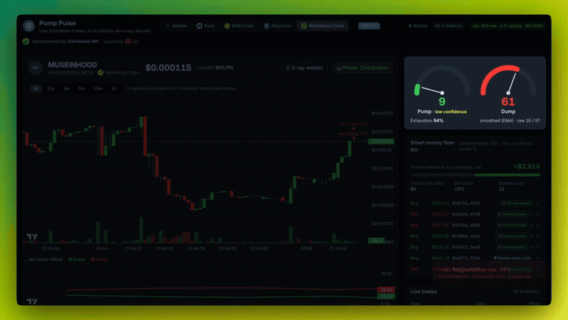
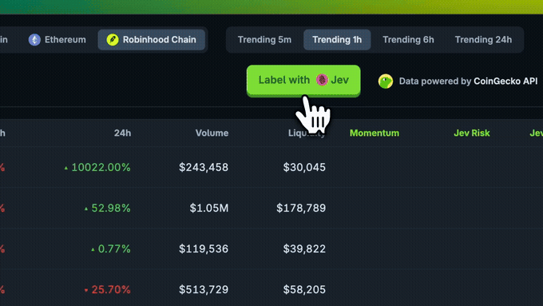
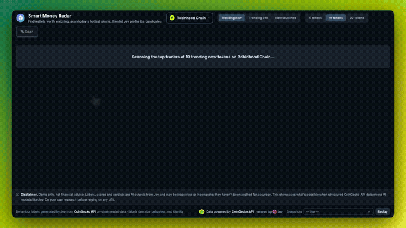
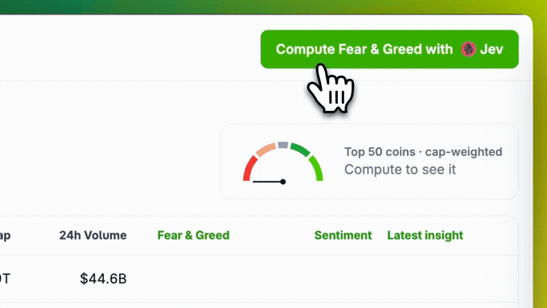

<p align="center"></p>

<h1 align="center">CoinGecko API × Jev</h1>
<p align="center"><b>Raw CoinGecko data in. Typed verdicts out.</b></p>

<p align="center"></p>

Six local demos showing what happens when CoinGecko's market, on-chain and wallet data gets handed straight to [Jev](https://typesafe.ai) (TypeSafe AI), a fast structured-decision model — one click turns a feed of tokens or wallets into labels, scores and verdicts.

Built on the CoinGecko API. Not a CoinGecko product, not financial advice — see [Disclaimer](#disclaimer).

| Demo | What it does |
|---|---|
| **Pump Pulse** | Live CoinGecko WebSocket trades build 1-second candles; Jev re-scores pump vs. dump pressure about once a second, with a live "smart money flow" read on the wallets behind the tape. |
| **Jev Labels + Wallet X-ray** | One click labels 20–50 trending on-chain tokens (momentum, rug risk, wash-like activity, and more). X-ray opens any token and classifies the wallets actually holding and trading it. |
| **Smart Money Radar + Wallet Profile** | Radar scans today's hottest tokens on a chain and surfaces candidate wallets worth following; Wallet Profile reads any address's multi-chain PnL, holdings, trades and transfers. |
| **Coin Fear & Greed** | A per-coin Fear & Greed index (not just one for the whole market) blending CoinGecko market data, Coin Insights and News, for the top coins, a category, or your own basket. |

<details>
<summary><b>More clips</b> (Jev Labels + X-ray, Smart Money Radar + Wallet Profile, Coin Fear &amp; Greed)</summary>
<br>



</details>

## Why

CoinGecko's on-chain and wallet data (trending pools, holders, top traders, multi-chain wallet PnL, trades, transfers, balances) is structured enough to hand straight to a model and get back something usable — a label, a score, a verdict — instead of just another chart. This repo is that pipeline, wired up end to end, so you can see it and run it yourself.

## Get your keys

You need two keys, both free to obtain:

1. **CoinGecko API key** — [get one here](https://www.coingecko.com/en/api). A free **Demo** key gets Jev Labels and Coin Fear & Greed running right away; Pump Pulse, Wallet X-ray, Smart Money Radar and Wallet Profile need an **Analyst** plan or higher — see [what each plan unlocks](#what-you-can-do-on-each-plan) and [pricing](https://www.coingecko.com/en/api/pricing). Full reference: [docs.coingecko.com](https://docs.coingecko.com/).
2. **TypeSafe (Jev) API key** — from TypeSafe AI, the `typesafe-sdk` package this repo depends on.

Save them where `start.sh` expects them (never inside this repo, and never committed):

```bash
mkdir -p ~/.coingecko ~/.typesafe
echo 'COINGECKO_PRO_API_KEY=your_key_here' >> ~/.coingecko/keys.env
echo 'TYPESAFE_API_KEY=your_key_here'      >> ~/.typesafe/keys.env
```

On a free Demo key instead of a paid plan, add `COINGECKO_DEMO_API_KEY` to the same file and set `CG_API_MODE=demo` before launching — the app talks to CoinGecko's Demo endpoint instead of Pro.

## Run it

```bash
git clone https://github.com/cg-growth/content.git
cd content/coingecko-jev
./install.sh   # once: Python 3.12 env + deps, via uv
./start.sh     # serves http://127.0.0.1:8787 and opens it
```

- Keys are read server-side by `start.sh` and never reach the browser.
- Each demo's dev bar (bottom of the page) has a fixture picker that replays a past recorded session without spending new API credits — handy for a first look.
- Tests: `.venv/bin/python -m pytest -q tests`.

## What you can do on each plan

| Demo | Demo / Free key | Analyst plan or higher |
|---|---|---|
| Jev Labels | ✅ Full | ✅ Full |
| Coin Fear & Greed | ✅ Market + Jev read | ✅ Adds News-driven sentiment |
| Pump Pulse | — | ✅ Full |
| Wallet X-ray | — | ✅ Full |
| Smart Money Radar | — | ✅ Full |
| Wallet Profile | — | ✅ Full |

## Disclaimer

This is a demo built on the CoinGecko API — it's not a CoinGecko product, and nothing here is investment advice. Labels and scores are AI outputs from Jev, working from CoinGecko API data, and may be inaccurate or incomplete. Do your own research before relying on any of it.

## Links

- [CoinGecko API](https://www.coingecko.com/en/api) — get a key
- [Pricing](https://www.coingecko.com/en/api/pricing) — plan tiers
- [API docs](https://docs.coingecko.com/) — full reference

## Maintained by

CoinGecko Growth team.
