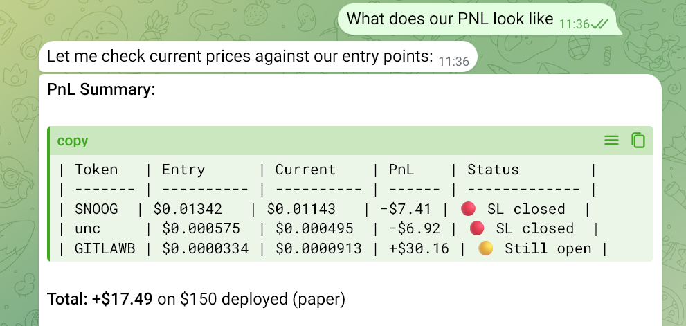
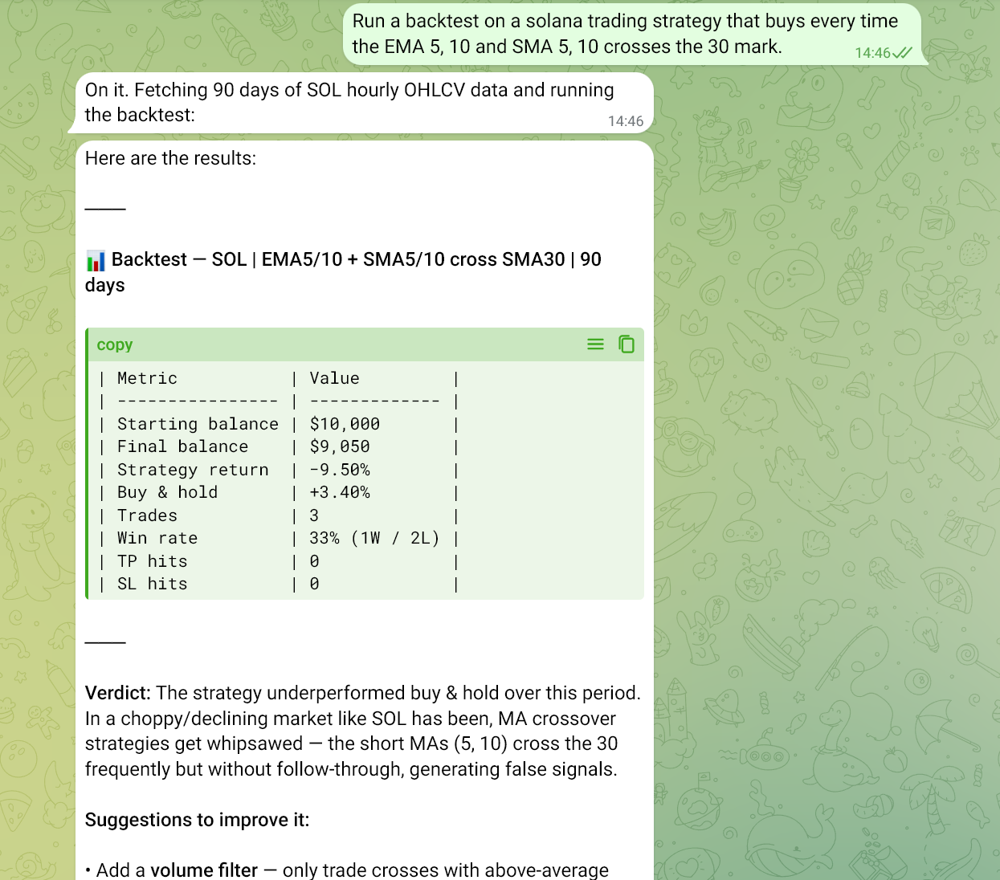

> Read the full article: [How to Build an OpenClaw AI Crypto Trading Agent with CoinGecko API](https://www.coingecko.com/learn/openclaw-crypto-trading-bot)

# TraderClaw — Quick Start Guide

## Examples

**On-chain PnL summary via Telegram:**



**Backtesting a Solana strategy via Telegram:**



---

## Prerequisites

Ensure the following are installed before proceeding:

- [OpenClaw](https://openclaw.io)
- [CoinGecko CLI](https://www.coingecko.com/en/developers/dashboard) (`cg`)
- Telegram account connected to OpenClaw
- Binance account with API access

---

## Setup

### 1. Clone the repo

```bash
git clone <this-repo> ~/.openclaw/workspace
```

### 2. Configure OpenClaw

```bash
openclaw configure
```

### 3. Add your Binance credentials for CEX trading and wallet Key for DEX trading

Edit `~/.openclaw/credentials/.env`:

```env
BINANCE_API_KEY=your_api_key_here
BINANCE_API_SECRET=your_api_secret_here
WALLET_PK= pk_here
```


It is **highly recommended** that you create fresh accounts / wallets with minimal budgets if live trading. AI Agents can be volatile. 

### 4. Authenticate with CoinGecko

```bash
cg auth login
```

### 5. Start trading

Open Telegram and talk to your agent in natural language.

---

## Project Structure

```
workspace/
├── config/
│   └── strategies.yaml      # All strategy parameters
├── skills/
│   ├── arbitrage/           # Cross-exchange arbitrage scanner
│   ├── onchain-disc/        # GeckoTerminal token discovery
│   ├── copy-trader/         # Top trader mirroring
│   ├── news-trader/         # Sentiment-based news trading
│   ├── coingecko-api/       # CoinGecko/GeckoTerminal API reference
│   └── backtesting/         # On-demand backtesting
├── trade_data/
│   ├── trades.json          # All paper trade history
│   ├── orders.json          # Open orders
│   └── ...                  # Strategy state files
├── SOUL.md                  # Agent personality
└── TOOLS.md                 # Architecture & config schema reference
```

---

## Strategies

This repo includes **5 agentic trading strategies** plus backtesting:

| Strategy | Description |
|---|---|
| `arbitrage` | Cross-exchange arbitrage scanner |
| `onchain-disc` | Early-stage token discovery via GeckoTerminal |
| `copy-trader` | Mirror trades from top-performing wallets |
| `news-trader` | Sentiment-driven trading from news signals |
| `backtesting` | On-demand strategy backtesting |

Strategy parameters are configured in `workspace/config/strategies.yaml`.

---

## Extending the Agent

To add new capabilities, create a new skill directory under `workspace/skills/` with a `SKILL.md` file defining the agent's behaviour.

> **Note:** Agentic performance scales with model quality. Smaller models are more likely to make errors or miss nuance. Use the best available model for optimal results.

---

## Disclaimer

This project is provided **for educational and informational purposes only**. Nothing in this repository constitutes financial advice, investment advice, or a recommendation to buy or sell any asset.

Trading cryptocurrencies carries significant risk, including the possible loss of all capital. Past performance is not indicative of future results. Automated trading systems can behave unexpectedly — always supervise your agent and never risk more than you can afford to lose.

The authors and contributors of this project make **no guarantees** of profitability, accuracy, or fitness for any particular purpose. Use at your own risk.
